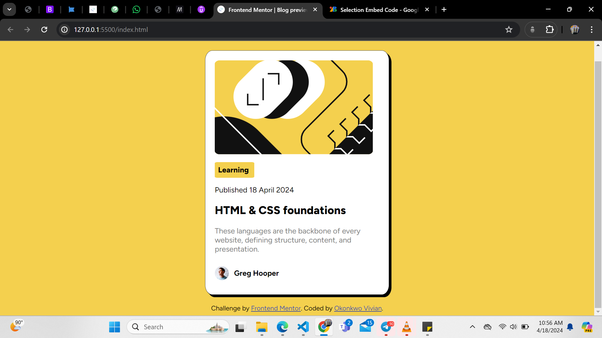

# Frontend Mentor - Blog preview card solution

This is a solution to the [Blog preview card challenge on Frontend Mentor](https://www.frontendmentor.io/challenges/blog-preview-card-ckPaj01IcS). Frontend Mentor challenges help you improve your coding skills by building realistic projects. 

## Table of contents

- [Overview](#overview)
  - [The challenge](#the-challenge)
  - [Screenshot](#screenshot)
  - [Links](#links)
- [My process](#my-process)
  - [Built with](#built-with)
  - [What I learned](#what-i-learned)
  - [Continued development](#continued-development)
  - [Useful resources](#useful-resources)
- [Author](#author)

## Overview

### The challenge

Users should be able to:

- See hover and focus states for all interactive elements on the page

### Screenshot



### Links
- Solution URL: https://github.com/vivi-uch/BLOG-PREVIEW-CARD
- Live Site URL:https://vivi-uch.github.io/BLOG-PREVIEW-CARD/

## My process

### Built with

- Semantic HTML5 markup
- CSS custom properties
- Box Shadow
- Inline Block


### What I learned

```css
/* CSS LINEAR GRADIENT */

#grad{
  background-image: linear-gradient(direction, color-stop1, color-stop2, ...);
}
/* DEFAULT DIRECTION: TOP TO BOTTOM */
#grad {
  background-image: linear-gradient(red, yellow);
}

#left-to-right {
  background-image: linear-gradient(to right, red , yellow);
}
#diagonal {
  background-image: linear-gradient(to bottom right, red, yellow);
}

/* Text shadow and Box shadow */
.text-shadow {
  color: coral;
  text-shadow: -1px 0 black, 0 1px black, 1px 0 black, 0 -1px black;
}

.box-shadow{
     box-shadow: 5px 5px;
}

/* styling the first occurence of particular tag in a section deifferentiated with a div or class */
#heading p:first-of-type {
  font-weight: bold;
  color: blue;
}

/* to style the nth occurence of such tag */
#heading p:nth-of-type(2) {
  /* Your styles for the second <p> tag inside the div with ID "heading" */
}

/* to display  elements with defaults of block display  on the same line */
#footer p{
    display: inline-block;
    vertical-align: middle;
}
/* You can as well align them to the middle */
```
### Continued development

I am still not comfortable with using the display property in CSS as well as float, flex. I hope to get better with more challenges.

### Useful resources

- [Frontend Mentor](https://www.frontendmentor.io/home) - This owner of this challenges.
- [Udemy Angela Yu Web dev course](https://www.udemy.com/course/the-complete-web-development-bootcamp/) - This is an amazing course that gave me insights in CSS in general.


## Author

- Linkeldn - [vivian okonkwo](https://www.linkedin.com/in/vivian-okonkwo-24b228253/)
- Frontend Mentor - [@okonks](https://www.frontendmentor.io/profile/okonks)
